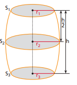

# Area di una botte

Una formula sufficientemente approssimata considera le superfici \(S_1\),
\(S_2\) e \(S_3\), dove \(S_1\) e \(S_3\) sono le superfici delle basi della botte e \(S_2\) è quella del cerchio massimo (solitamente a metà dell’altezza della botte), e l’altezza \(h\).
Il volume $V$ della botte è dato dalla relazione:
$V=\frac{1}{6}h(S_1 + 4S_2 + S_3)$

Considerando che l'area di un cerchio è $S=\pi r^2$ e $\pi=3.1415$,
qual'è l'area di una botte di cui il raggio del cerchio superiore è $r1=30cm$, il raggio del cerchio intermedio (a metà della botte) è $r2=45cm$ e il raggio del cerchio alla base (inferiore) è $r3=33cm$ con altezza $h=130cm$?

-NB: Il volume va ovviamente rappresentato in litri
-NB: Opzionale: le dimensioni della botte vanno lette da terminale
